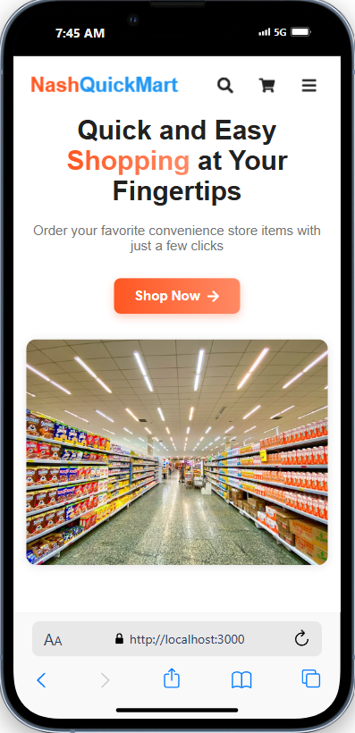
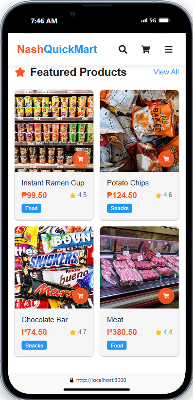
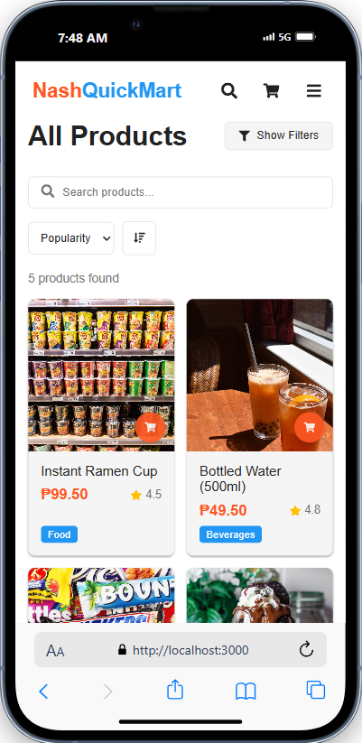
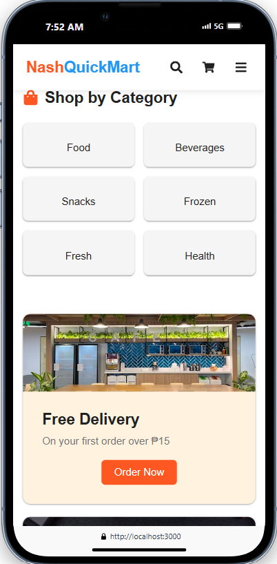
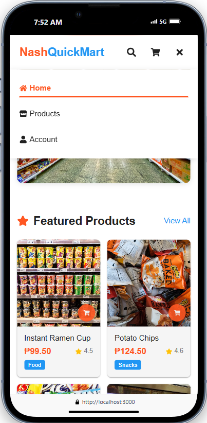
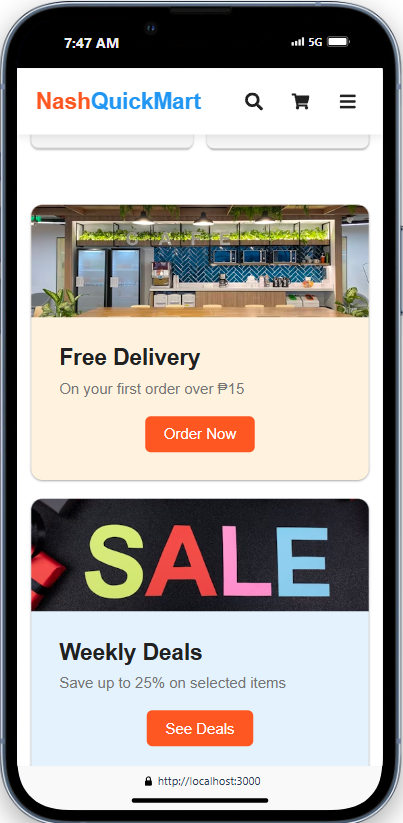
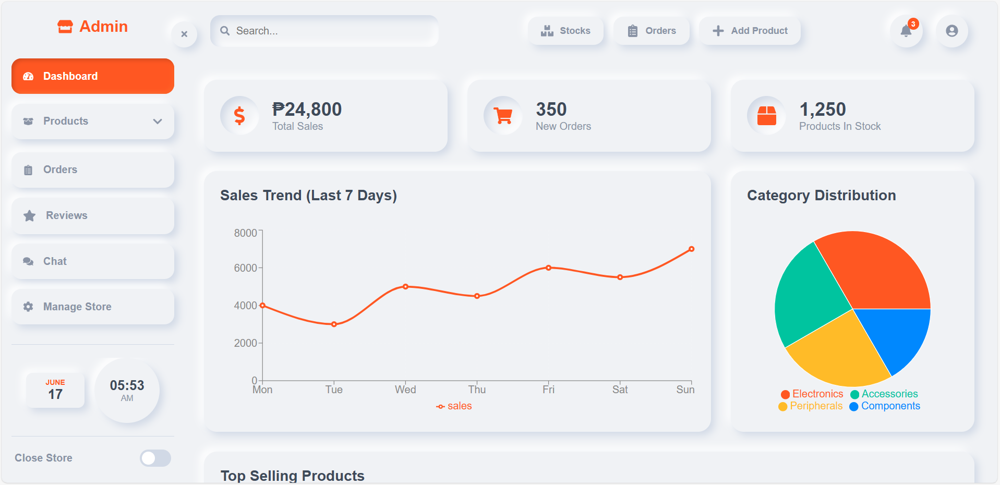
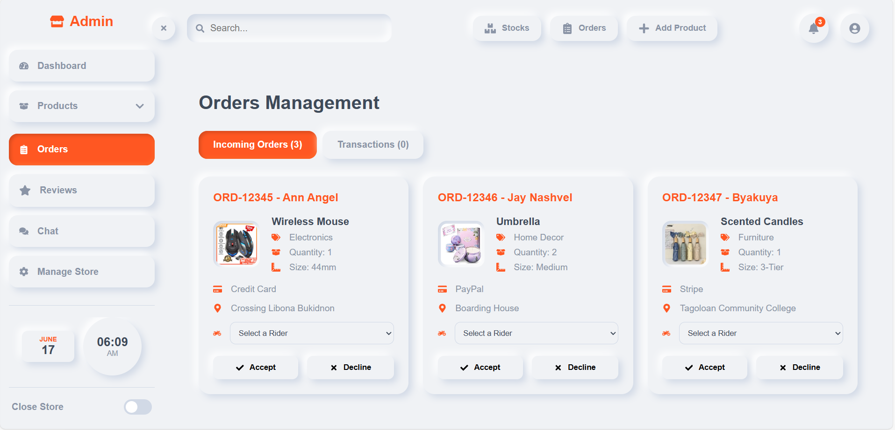
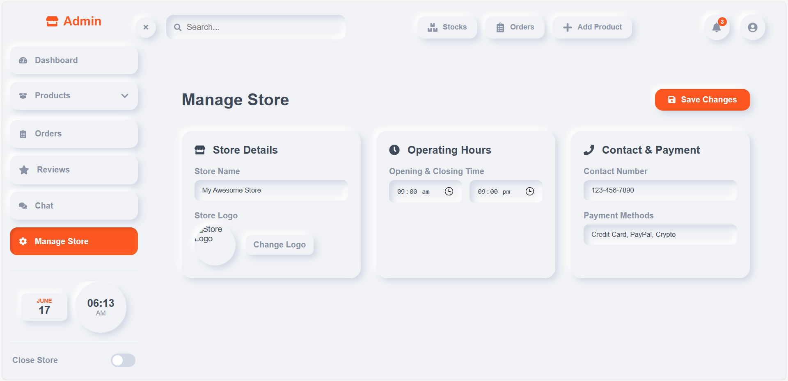
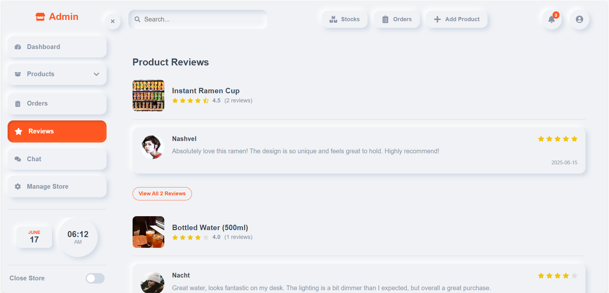

# Convenience Store Ordering System

This is a web application for browsing and ordering items from a convenience store. Users can browse products, view details, add items to their cart, and place an order.

## Features

- 🏠 **Home Page**: Displays featured products and special offers.
- 🛍️ **Products Page**: Browse all available items with filtering and sorting options.
- 📄 **Product Details**: View detailed information about a specific item.
- 🛒 **Cart**: Add and remove items from the shopping cart.
- 📜 **Order History**: View past orders and track current ones.
- ❤️ **Favorites**: Save items for easy reordering.
- ⭐ **Product Ratings & Comments**: View and leave feedback on products.
- 📱💻 **Modern & Responsive UI**: A clean interface that works on all devices.

> **Note**: Some features are currently in development and will be available in future updates.

## Screenshots (outdated images)

<table width="100%">
  <tr>
    <td align="center" valign="top" width="33%">
      
       
      <b>Home Page</b>
    </td>
    <td align="center" valign="top" width="33%">
      
       
      <b>Product Page</b>
    </td>
    <td align="center" valign="top" width="33%">
      
       
      <b>All Products</b>
    </td>
  </tr>
  <tr>
    <td align="center" valign="top" width="33%">
      
       
      <b>Categories</b>
    </td>
    <td align="center" valign="top" width="33%">
      
       
      <b>Navbar</b>
    </td>
    <td align="center" valign="top" width="33%">
      
       
      <b>Footer</b>
    </td>
  </tr>
</table>

## Tech Stack

This project is built with a modern, multi-platform stack:

  
  
  

- **Frontend**: A responsive web interface built with **React.js**.
- **Backend**: A robust API powered by **CodeIgniter 4**.
- **Mobile**: A cross-platform mobile app developed with **React Native**.

> **Database**: The database schema and integration are planned for a future update.

## Client Dashboard

<table width="100%">
  <tr>
    <td align="center" valign="top" width="50%">
      
       
      <b>Client Dashboard</b>
    </td>
    <td align="center" valign="top" width="50%">
      
       
      <b>Client Orders</b>
    </td>
  </tr>
  <tr>
    <td align="center" valign="top" width="50%">
      
       
      <b>Client Store</b>
    </td>
    <td align="center" valign="top" width="50%">
      
       
      <b>Client Reviews</b>
    </td>
  </tr>
</table>

> **Note**: Client Dashboard is currently desktop-only, mobile version is in development.
